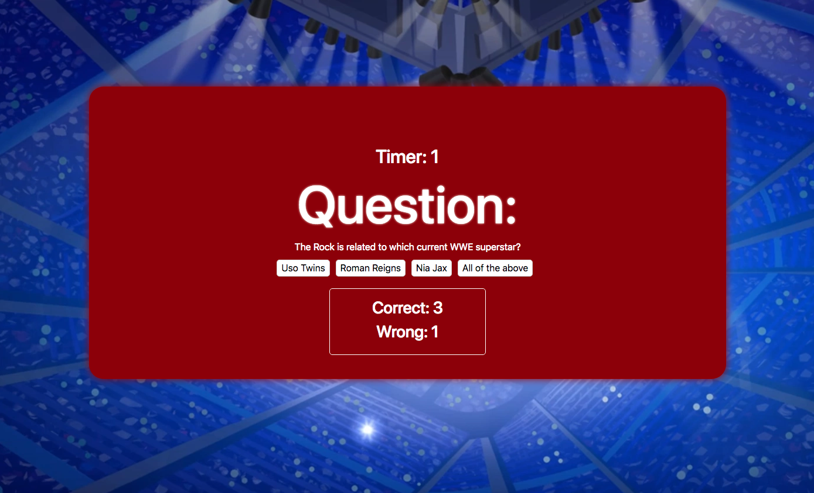

# TriviaGame
A Trivia Game Built in JS and jQuery

* Game Rules

1. Click the start button to begin quiz

2. Choose your answer out of the options

3. User has 20 seconds to choose answer if the question isnt answered within that time the question will go to the next

4. User can view progress in a box at the bottom of the game window

* How to make game

1. Click event for Start button to show quiz

2. document.querySelectorAll(".answer")

3. Start first question after Start Button is clicked

4. Set Timer to 30 sec per question

5. Let the user know if they have selected the right answer (show a screen congratulating them)

6. Or let the user know their answer is wrong

7. After 30 min automatically move to the next question (slide)

8. Set a message that says out of time if the question isnt answered after 30 sec 

9. Then show the correct message

10. Move onto the next question

11. Create final screen showing user number of correct and wrong answers

12. Give the option to restart the game without refreshing the page